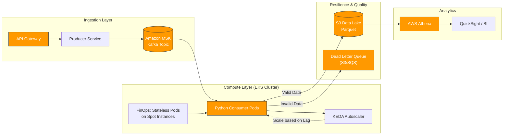

# Chargeflow Data Engineering Assignment

A resilient, scalable data pipeline designed to ingest, validate, and analyze high-volume financial data for fraud detection and reporting.


## 📋 Executive Summary
This project implements an ETL pipeline capable of processing disparate e-commerce data sources (Transactions, Orders, Chargebacks). While the current implementation runs locally on file-based inputs, the underlying architecture is designed for a **distributed, event-driven environment** (Kubernetes/Kafka) with a strong focus on data quality and cost efficiency.

## 🏗 System Architecture

The solution is architected to transition from batch processing to real-time streaming to detect fraud faster.

### Production Design (Target Architecture)
In a production environment (AWS), this pipeline is designed to run as a consumer within an **EKS (Kubernetes)** cluster, processing events from **Amazon MSK (Kafka)**.



## 🚀 Key Engineering Decisions

### 1. Shift-Left Data Validation (Pydantic)
Instead of letting bad data propagate to the Data Lake, strict validation is applied at the ingestion point using **Pydantic Models**.

* **Why:** Early detection prevents "Garbage In, Garbage Out."
* **Mechanism:** Records failing validation (e.g., negative amounts, missing foreign keys) are isolated to a `failed_records` stream (DLQ pattern) without crashing the pipeline.

### 2. FinOps & Cost Optimization
* **Compute:** The processing logic is stateless, making it ideal for **AWS Spot Instances** (saving ~70% on compute).
* **Containerization:** Uses `python:3.9-slim` base image to minimize storage footprint and speed up cold starts in K8s.
* **Storage Strategy:** Production data would be stored in columnar formats (**Parquet/Iceberg**) to reduce S3 scan costs during analysis.

### 3. Observability & Metrics
The pipeline calculates critical business KPIs during transformation:
* **Chargeback Rate:** (Total Dispute Value / Total Transaction Volume) per payment method.
* **Payment Failure Rate:** Critical for monitoring provider health.

## 🛠️ Getting Started

### Prerequisites
* Python 3.9+
* Docker (Optional, but recommended)

### Option A: Running with Docker (Recommended)
The project is fully containerized to ensure consistency.

```bash
# 1. Build the image
docker build -t chargeflow-assignment .

# 2. Run the full pipeline
docker run --rm chargeflow-assignment python -m src.pipeline

# 3. Run the test suite
docker run --rm chargeflow-assignment pytest -v
```

## Option B: Local Setup

```bash
# 1. Create virtual environment
python -m venv .venv
source .venv/bin/activate  # or .venv\Scripts\activate on Windows

# 2. Install dependencies
pip install -r requirements.txt

# 3. Generate fresh dummy data
python src/generate_data.py

# 4. Run the pipeline
python src/pipeline.py
```

## 🧪 Testing Strategy
Comprehensive testing is implemented using `pytest` with **30+ unit tests**:

* **Fixtures:** Data is injected via fixtures (no dependency on local files).
* **Edge Cases:** Tests cover negative amounts, orphaned records, and currency mismatches.
* **Logic Verification:** Metric calculations are verified against known datasets.

## 🔮 Future Improvements
* **Schema Registry:** Integrate with **AWS Glue Schema Registry** to manage schema evolution safely.
* **Distributed Processing:** Migrate `pandas` transformation to **Apache Spark** or **DuckDB** if data volume exceeds memory limits.
* **Fraud Rings:** Implement Graph Database (**Amazon Neptune**) integration to detect circular dependencies between users and chargebacks.