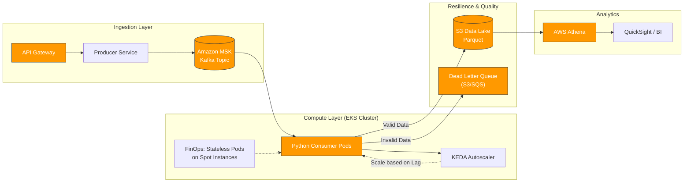

# Chargeflow Data Engineering Assignment

A resilient, scalable data pipeline designed to ingest, validate, and analyze high-volume financial data for fraud detection and reporting.


## 📋 Executive Summary
This project implements an ETL pipeline capable of processing disparate e-commerce data sources (Transactions, Orders, Chargebacks). While the current implementation runs locally on file-based inputs, the underlying architecture is designed for a **distributed, event-driven environment** (Kubernetes/Kafka) with a strong focus on data quality and cost efficiency.

## 🏗 System Architecture

The solution is architected to transition from batch processing to real-time streaming to detect fraud faster.

### Production Design (Target Architecture)
In a production environment (AWS), this pipeline is designed to run as a consumer within an **EKS (Kubernetes)** cluster, processing events from **Amazon MSK (Kafka)**.



## 🚀 Key Engineering Decisions

### 1. Shift-Left Data Validation (Pydantic)
Instead of letting bad data propagate to the Data Lake, strict validation is applied at the ingestion point using **Pydantic Models**.

* **Why:** Early detection prevents "Garbage In, Garbage Out."
* **Mechanism:** Records failing validation (e.g., negative amounts, missing foreign keys) are isolated to a `failed_records` stream (DLQ pattern) without crashing the pipeline.

### 2. FinOps & Cost Optimization
* **Compute:** The processing logic is stateless, making it ideal for **AWS Spot Instances** (saving ~70% on compute).
* **Containerization:** Uses `python:3.9-slim` base image to minimize storage footprint and speed up cold starts in K8s.
* **Storage Strategy:** Production data would be stored in columnar formats (**Parquet/Iceberg**) to reduce S3 scan costs during analysis.

### 3. Observability & Metrics
The pipeline calculates critical business KPIs during transformation:
* **Chargeback Rate:** (Total Dispute Value / Total Transaction Volume) per payment method.
* **Payment Failure Rate:** Critical for monitoring provider health.

## 🛠️ Getting Started

### Prerequisites
* Python 3.9+
* Docker (Optional, but recommended)

### Option A: Running with Docker (Recommended)
The project is fully containerized to ensure consistency.

```bash
# 1. Build the image
docker build -t chargeflow-assignment .

# 2. Run the full pipeline
docker run --rm chargeflow-assignment python -m src.pipeline

# 3. Run the test suite
docker run --rm chargeflow-assignment pytest -v
```

## Option B: Local Setup

```bash
# 1. Create virtual environment
python -m venv .venv
source .venv/bin/activate  # or .venv\Scripts\activate on Windows

# 2. Install dependencies
pip install -r requirements.txt

# 3. Generate fresh dummy data
python src/generate_data.py

# 4. Run the pipeline
python src/pipeline.py
```

## 🧪 Testing Strategy
Comprehensive testing is implemented using `pytest` with **30+ unit tests**:

* **Fixtures:** Data is injected via fixtures (no dependency on local files).
* **Edge Cases:** Tests cover negative amounts, orphaned records, and currency mismatches.
* **Logic Verification:** Metric calculations are verified against known datasets.

## 💻 Sample Execution Output

Here is the actual output from a successful pipeline run, demonstrating the validation logic and metric calculation:

<details>
<summary>Click to expand execution logs</summary>

```text
2026-01-28 09:09:16,266 - INFO - ==================================================
2026-01-28 09:09:16,266 - INFO - Starting data ingestion and validation
2026-01-28 09:09:16,266 - INFO - ==================================================
2026-01-28 09:09:16,266 - INFO - Loading /app/data/transactions.json
2026-01-28 09:09:16,267 - WARNING - Transactions validation failed at index 15: Value error, amount must be strictly positive
2026-01-28 09:09:16,267 - WARNING - Transactions validation failed at index 30: Value error, amount must be strictly positive
2026-01-28 09:09:16,268 - INFO - Transactions: 98 valid, 2 failed (98.0% success rate)
2026-01-28 09:09:16,268 - INFO - Loading /app/data/orders.json
2026-01-28 09:09:16,269 - WARNING - Orders validation failed at index 15: Value error, total_amount must be strictly positive
2026-01-28 09:09:16,270 - INFO - Orders: 99 valid, 1 failed (99.0% success rate)
2026-01-28 09:09:16,270 - INFO - Loading /app/data/chargebacks.csv
2026-01-28 09:09:16,271 - WARNING - Chargebacks validation failed at index 0: Value error, amount must be strictly positive
2026-01-28 09:09:16,271 - WARNING - Chargebacks validation failed at index 19: Value error, amount must be strictly positive
2026-01-28 09:09:16,271 - INFO - Chargebacks: 18 valid, 2 failed (90.0% success rate)
2026-01-28 09:09:16,271 - INFO - Ingestion and validation complete
2026-01-28 09:09:16,271 - INFO - ==================================================
2026-01-28 09:09:16,272 - INFO - Starting data transformation
2026-01-28 09:09:16,272 - INFO - ==================================================
2026-01-28 09:09:16,273 - INFO - Transactions DataFrame: 98 rows
2026-01-28 09:09:16,275 - INFO - Orders DataFrame: 99 rows
2026-01-28 09:09:16,276 - INFO - Chargebacks DataFrame: 18 rows
2026-01-28 09:09:16,279 - INFO - After merging with orders: 98 rows
2026-01-28 09:09:16,282 - INFO - After merging with chargebacks: 98 rows
2026-01-28 09:09:16,285 - INFO - Transformation complete
2026-01-28 09:09:16,288 - INFO - Daily volume calculated for 60 days
2026-01-28 09:09:16,298 - INFO - Chargeback rates calculated for 3 payment types
2026-01-28 09:09:16,301 - INFO - Payment failure rate: 34.69% (34/98)

============================================================
VALIDATION SUMMARY
============================================================

TRANSACTIONS:
  Valid:   98
  Failed:  2
  Success: 98.0%

ORDERS:
  Valid:   99
  Failed:  1
  Success: 99.0%

CHARGEBACKS:
  Valid:   18
  Failed:  2
  Success: 90.0%

============================================================
FAILED VALIDATION DETAILS
============================================================

TRANSACTIONS failures:
  Index 15: Value error, amount must be strictly positive
  Index 30: Value error, amount must be strictly positive

ORDERS failures:
  Index 15: Value error, total_amount must be strictly positive

CHARGEBACKS failures:
  Index 0: Value error, amount must be strictly positive
  Index 19: Value error, amount must be strictly positive

============================================================
ANALYSIS RESULTS
============================================================

DAILY VOLUME (sample):
      date  total_amount
2025-10-31       1209.62
2025-11-01        779.24
2025-11-02        526.08
2025-11-03       2872.29
2025-11-04       2260.90
2025-11-05        405.06
2025-11-06       1789.80
2025-11-07        105.48
2025-11-09       1079.58
2025-11-10       3423.63

CHARGEBACK RATES BY PAYMENT TYPE:
payment_type  total_txn_amount  total_cb_amount  chargeback_rate
 credit_card          23458.88          2830.75            12.07
  debit_card          21644.10          4371.91            20.20
      wallet          12532.63          1899.29            15.15

PAYMENT FAILURE RATE: 34.69%
```

## 🔮 Future Improvements
* **Schema Registry:** Integrate with **AWS Glue Schema Registry** to manage schema evolution safely.
* **Distributed Processing:** Migrate `pandas` transformation to **Apache Spark** or **DuckDB** if data volume exceeds memory limits.
* **Fraud Rings:** Implement Graph Database (**Amazon Neptune**) integration to detect circular dependencies between users and chargebacks.